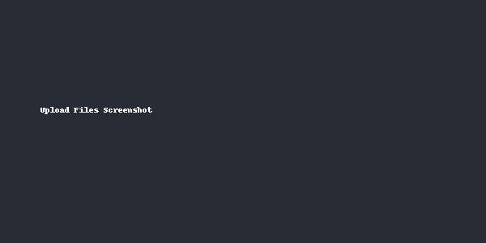

# 🎓 Student Portal

A futuristic **student portal website** with admin and student login.  
Deploy instantly on **GitHub Pages**.

---

## 🚀 Features
- Student login with unique username & password  
- Admin portal with default credentials  
- Futuristic gradient UI  
- Ready to deploy on GitHub Pages  

---

## 🔑 Default Admin Login
- **Username:** `admin`  
- **Password:** `Admin@123`

---

## 📂 Project Structure
```
student-portal/
│── index.html
│── styles.css
│── app.js
│── README.md
│── screenshots/
```

---

## ⚡ Deployment Guide

1. **Create Repository**  
   

2. **Upload Files**  
   

3. **Enable GitHub Pages**  
   

4. **Access Website**  
   

---

## 👨‍💻 Author
Built with ❤️ by DevByHaarizx

